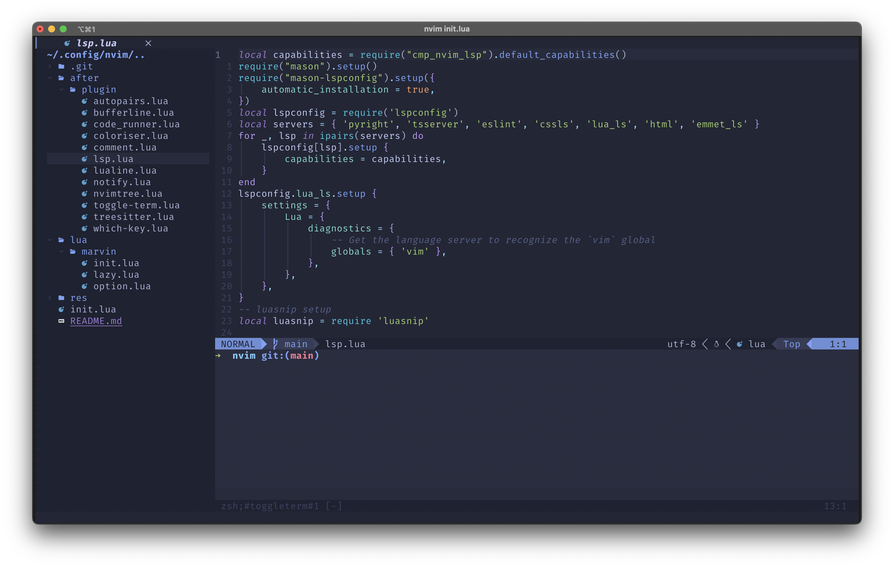

# NeoChad
Neovim config for Linux Chads

<h2>The config is in beta stage </h2>


## Installation

To install just use the following command 
1. Clone the repository:

   ```shell
   git clone https://github.com/anon-marvin/NeoChad ~/.config/nvim
